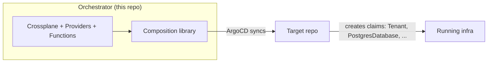
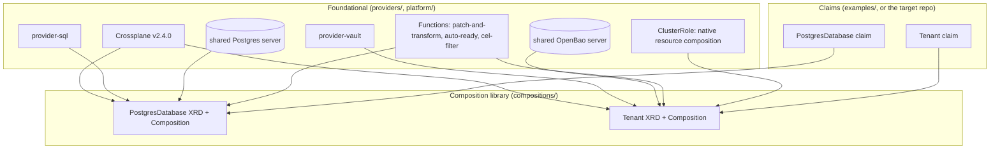

# Architecture

## Purpose and scope

`Orchestrator` bootstraps the base platform tooling for IdPlatformKit and hosts a library of reusable Crossplane Compositions. It's deliberately split from the repository that will instantiate those compositions for real workloads:

- **This repo**: installs Crossplane, the providers/functions Compositions need, and the reusable `XRD`/`Composition` pairs themselves.
- **The target repo** (separate, not this one): creates the actual claims (`Tenant`, `PostgresDatabase`, ...) that instantiate infrastructure. ArgoCD is used here only to install itself and to sync with that target repo — it does not manage application-specific compositions.

## Two ways to install

| Path | Entry point | Use case |
|---|---|---|
| Local, no GitOps | `make local-up` (root `Makefile`) | Try a composition on a disposable [kind](https://kind.sigs.k8s.io/) cluster, no cloud credentials, no ArgoCD |
| Real bootstrap | ArgoCD Application pointing at `compositions/` (and `providers/`) | Installs the same manifests onto a real cluster, GitOps-synced |

Both paths apply the exact same `compositions/` and `providers/` kustomize bases — there is one source of truth for what gets installed, regardless of how it gets there. See the root [README](../README.md) for the exact commands.

## Layers

### Why Crossplane v2

The repo runs Crossplane **v2.4.0**, not v1. Two v2 features are load-bearing, not incidental:

1. **Namespaced XRs.** A v1-style separate "claim" kind isn't needed — `PostgresDatabase` XRs are created directly, namespaced, by the caller. `Tenant` is the one exception: it's `scope: Cluster` because a Tenant claim *mints a new namespace*, so it can't itself live inside one.
2. **Composing native Kubernetes resources directly.** The `Tenant` composition creates a `Namespace`, `ResourceQuota`, `LimitRange`, `RoleBinding` and `NetworkPolicy` with no `provider-kubernetes` involved — Crossplane v2 composes any Kubernetes resource, not just managed resources. This requires explicitly granting Crossplane's controller RBAC for those kinds (see below); it doesn't get that for free.

### Providers and Functions (`providers/`)

Applied once, before any composition or claim — these are prerequisites, not part of the reusable library itself.

| Name | Kind | Purpose |
|---|---|---|
| `provider-sql` | Provider | Manages logical databases/roles on the shared Postgres server (`PostgresDatabase`) |
| `provider-vault` | Provider | Manages Vault/OpenBao namespaces, mounts, policies and Kubernetes auth (`Tenant`'s optional add-on) |
| `function-patch-and-transform` | Function | The composition engine for both XRDs — patches an XR's spec onto a set of composed resource templates |
| `function-auto-ready` | Function | Marks composed resources `Ready` once their own health signals say so (Crossplane managed resources) |
| `function-cel-filter` | Function | Conditionally drops composed resources from the desired set based on a CEL expression over the XR's spec — this is how `Tenant`'s optional Vault add-on is toggled without a second Composition |
| `crossplane-tenant-native-resources` | ClusterRole | Aggregates (`rbac.crossplane.io/aggregate-to-crossplane: "true"`) into Crossplane's own ClusterRole, granting it rights over `namespaces`, `resourcequotas`, `limitranges`, `rolebindings` and `networkpolicies` — plus the RBAC `bind` verb specifically on the `edit` ClusterRole, which Kubernetes' privilege-escalation check requires before Crossplane can create a `RoleBinding` to it |
| `postgres-providerconfig.yaml`, `openbao-providerconfig.yaml` | ClusterProviderConfig | Point `provider-sql`/`provider-vault` at the shared local Postgres/OpenBao servers |

Plain native-resource composed objects (`Namespace`, `ResourceQuota`, ...) don't carry a `Ready` status condition the way managed resources do — the `Tenant` composition marks those `readinessChecks: [{type: None}]` (ready as soon as created) rather than relying on `function-auto-ready` to infer it, since that inference isn't reliable across provider/function versions (see [compositions/tenant.md](compositions/tenant.md) for how this was actually discovered).

### Shared platform services (`platform/`)

Two "foundational infrastructure" servers, installed directly via Helm (not provisioned *by* Crossplane) — the same tier as Crossplane and ArgoCD themselves, and explicitly **not production-grade**: single replica, dev/in-memory modes, fixed local credentials.

- `platform/postgres-server/` — Bitnami `postgresql` chart. One shared server; `PostgresDatabase` claims get a logical database + role on it (see [compositions/postgres-database.md](compositions/postgres-database.md)).
- `platform/openbao-server/` — [OpenBao](https://openbao.org/) (not HashiCorp Vault) in dev mode. Chosen specifically because it ships real Vault **Namespaces** — genuine per-tenant secrets isolation — free in its community edition, where Vault gates that behind Enterprise. See [compositions/tenant.md](compositions/tenant.md) for why that distinction mattered here.

## Composition library (`compositions/`)

| Composition | Scope | What it gives a caller |
|---|---|---|
| [`PostgresDatabase`](compositions/postgres-database.md) | Namespaced | A logical Postgres database + role, connection details in a Secret |
| [`Tenant`](compositions/tenant.md) | Cluster | A namespace baseline (quota, RBAC, network policy) plus an optional, toggleable, genuinely-isolated Vault secrets space |

Both follow the same shape: one shared backing service (Postgres / OpenBao) installed once at the platform level, and a Composition that provisions a caller-scoped slice of it (a database+role / a Vault namespace) rather than a dedicated instance per claim. That keeps local `kind` usage cheap and fast; it is a deliberate simplicity trade-off, not a scalability claim for a real multi-tenant production cluster.

## Non-goals / current limitations

- No production hardening: both shared backing servers run in single-replica, dev/in-memory modes with fixed local credentials — fine for `kind`, not for a real cluster.
- No GitOps wiring yet: ArgoCD is mentioned in the [README](../README.md) as the intended real-bootstrap path but isn't set up in this repo yet; only the local `kind` path is implemented and verified today.
- `Tenant`'s Vault add-on stops at "the policy and auth role exist and a named ServiceAccount can use them" — it doesn't (yet) pull those secrets into Kubernetes `Secret`s. That's a deliberate stopping point: it's the direct prerequisite for a planned External Secrets Operator (ESO) integration, which would authenticate the same way.
- `PostgresDatabase` is not (yet) composable *from* a `Tenant` claim (nested XR composition), even though Crossplane supports it — each composition is proven independently first.
