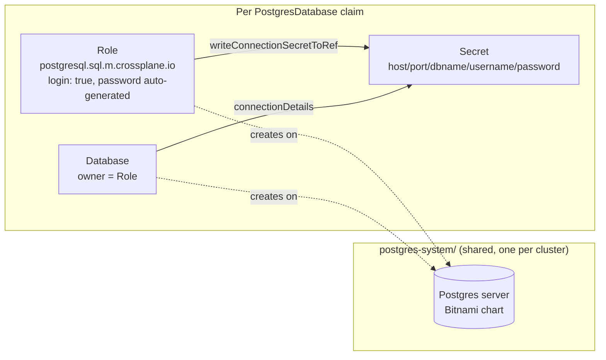

# `PostgresDatabase`

Self-service logical Postgres database. Defined in [`compositions/postgres-database/`](../../compositions/postgres-database/).

```yaml
apiVersion: database.idplatformkit.io/v1alpha1
kind: PostgresDatabase
metadata:
  name: demo-app        # also the database name, the role name, and the K8s object name
  namespace: default
spec:
  writeConnectionSecretToRef:
    name: demo-app-db-conn
```

`ownerGroup`/RBAC-style parameters aren't needed here — this XRD's schema has exactly one required field, `writeConnectionSecretToRef.name`. Everything else is derived from `metadata.name`.

## Architecture



- **Shared server, not one-per-claim.** `platform/postgres-server/` installs *one* Postgres server for the whole cluster. `provider-sql` then manages logical `Database`/`Role` objects on it per claim — much cheaper than a full Postgres instance per database, matching the "shared server, per-tenant logical partition" pattern used throughout this repo.
- **`Role` owns `Database`.** The `Database`'s `forProvider.owner` is set to the `Role`'s name, so the role gets full rights on everything it creates in that database without a separate `Grant` resource.
- **Password never touches the Composition.** `provider-sql`'s `Role` auto-generates its password and writes it straight to a connection secret (`writeConnectionSecretToRef`) — the Composition only reads `username`/`password` back out via `connectionDetails: [{type: FromConnectionSecretKey, ...}]` to fold them into the claim's own aggregated secret alongside `host`/`port`/`dbname`.
- **Crossplane v2 has no built-in XR connection-secret aggregation** (a v1 feature that was dropped). The `writeConnectionSecretToRef` block at the top of the Composition's pipeline input is what recreates it: it patches the XR's `spec.writeConnectionSecretToRef.name` into the function's own aggregation target.

## Try it

```sh
make local-up
make try-postgres-database   # applies examples/postgres-database.yaml, prints the connection secret
```

Verified end-to-end (not just `Ready`): the generated credentials were used to run an actual `psql` session against the shared server — connect, `CREATE TABLE`, `INSERT`, `SELECT` all succeeded as the auto-provisioned role.
