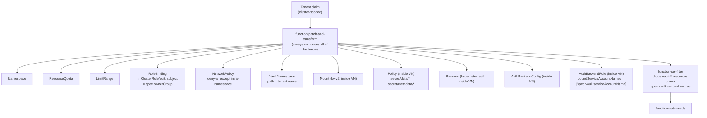

# `Tenant`

Self-service namespace baseline, with an optional per-tenant Vault secrets space. Defined in [`compositions/tenant/`](../../compositions/tenant/).

```yaml
apiVersion: platform.idplatformkit.io/v1alpha1
kind: Tenant
metadata:
  name: demo-team   # also the namespace name, and the Vault namespace path
spec:
  ownerGroup: demo-team-engineers
  vault:
    enabled: true
    serviceAccountName: demo-app   # the *only* ServiceAccount allowed to use this tenant's Vault access
```

`Tenant` is `scope: Cluster` (unlike `PostgresDatabase`) — it mints a *new* namespace, so it can't itself live inside one. Every composed namespaced resource therefore gets an explicit `metadata.namespace` patch rather than inheriting the XR's own namespace.

## Architecture



The baseline (`Namespace`, `ResourceQuota`, `LimitRange`, `RoleBinding`, `NetworkPolicy`) is always created. The six `vault-*` resources are always *composed* by `function-patch-and-transform` but then conditionally kept or dropped by a second pipeline step, `function-cel-filter`, matching every composed resource whose name matches `vault-.*` against one CEL expression: `has(observed.composite.resource.spec.vault) && observed.composite.resource.spec.vault.enabled`. This is what lets one Composition serve both "just a namespace" and "namespace + secrets space" claims — no second Composition, no per-capability XRD.

## Why OpenBao, not Vault

Vault Community Edition gates real **Namespaces** — a genuine per-tenant isolation boundary with its own policies, mounts and auth methods — behind Vault Enterprise. [OpenBao](https://openbao.org/), the Linux Foundation's open-source Vault fork, ships Namespaces free and GA in its community edition. That's the one feature this design actually needs, so the shared server is OpenBao (`platform/openbao-server/`, dev mode) rather than Vault, and `provider-vault` (Terraform-based, Vault-API-compatible, so it talks to OpenBao without modification) is pointed at it.

Each tenant gets its **own** `VaultNamespace`, with its **own** `secret/` kv-v2 `Mount` and `Policy` inside it — not a shared mount with per-tenant path prefixes. This was verified directly, not assumed: a secret written into one tenant's namespace is invisible both from the root namespace and from a second tenant's namespace.

## Accessing a tenant's Vault namespace

`spec.vault.serviceAccountName` names the **one** Kubernetes ServiceAccount (in the tenant's own namespace) allowed to authenticate as that tenant. The Composition does not create that ServiceAccount — it only wires the trust relationship (a Kubernetes auth `Backend` + `AuthBackendConfig` + `AuthBackendRole`, all scoped inside the tenant's own Vault namespace). Create the ServiceAccount yourself alongside the workload that needs it:

```sh
kubectl create serviceaccount demo-app -n demo-team
```

A pod running as that ServiceAccount authenticates with its own projected token:

```sh
JWT=$(cat /var/run/secrets/kubernetes.io/serviceaccount/token)
curl -s --request POST \
  --header "X-Vault-Namespace: demo-team" \
  --data "{\"role\": \"tenant-access\", \"jwt\": \"$JWT\"}" \
  http://openbao.openbao-system.svc.cluster.local:8200/v1/auth/kubernetes/login
```

Any other ServiceAccount — including a different one in the *same* namespace — gets `"service account name not authorized"`. This was verified with a real pod running as an unbound ServiceAccount, not just inferred from the config.

This Kubernetes-auth-to-policy path is also the direct prerequisite for a planned later step: pulling these secrets into Kubernetes `Secret`s per tenant via [External Secrets Operator](https://external-secrets.io/) (ESO). ESO's Vault provider would authenticate the same way, against the same per-tenant role — nothing here needs to change to support that later.

## A real gotcha: deletion ordering

The six `vault-*` resources are nested inside the tenant's own `VaultNamespace` (`spec.forProvider.namespace: <tenant>` on each). Deleting a Vault namespace already recursively wipes everything inside it — confirmed directly against a live OpenBao server. But if Crossplane also tries to delete a child resource (`Mount`, `Policy`, the auth `Backend`/`AuthBackendConfig`/`AuthBackendRole`) *after* the parent namespace is already gone (e.g. because `spec.vault.enabled` flips to `false`, or the whole `Tenant` is deleted), that call 404s (`"namespace not found"`) — and `provider-vault` doesn't treat that as success, so the resource gets stuck retrying its delete forever.

The fix, applied to all five children (everything except `vault-namespace` itself):

```yaml
spec:
  managementPolicies: ["Observe", "Create", "Update", "LateInitialize"]  # no "Delete"
```

Excluding `Delete` means Crossplane removes the Kubernetes object without calling the provider's delete on the external resource — correct here specifically because the parent `VaultNamespace`'s own (normal, `Delete`-included) deletion already does that recursively. This was found and fixed by actually toggling `spec.vault.enabled` off and watching a resource get stuck, twice — first with the wrong mechanism (`spec.deletionPolicy: Orphan`, which doesn't exist on this provider's schema), then with the right one.

## Try it

```sh
make local-up
make try-tenant    # applies examples/tenant.yaml (vault.enabled: true), shows what got created
```

Toggle `spec.vault.enabled` on an existing `Tenant` claim and re-apply to see the six `vault-*` resources get created or fully torn down (confirmed both in Kubernetes and directly on the OpenBao server) while the namespace baseline stays untouched.
